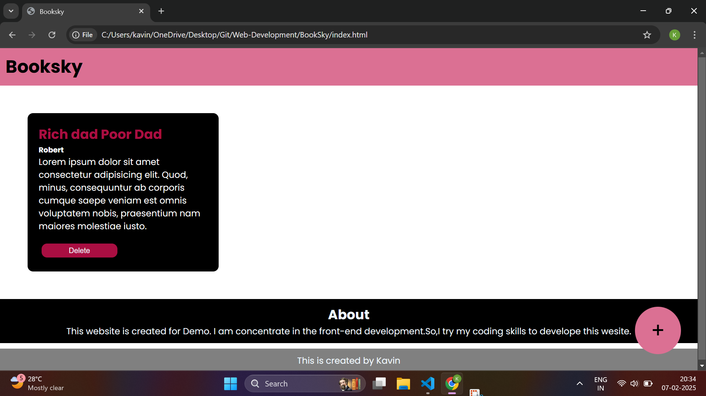

# BookSky

BookSky is a **modern online book library** where users can explore, search, and manage books. It provides a user-friendly interface to browse books by category, author, or title.

## 🚀 Features
- 📚 Browse books by category, author, or title
- 🔍 Search functionality for quick access
- 🏷️ Book details with descriptions and covers
- 🌙 Light & Dark Mode for better readability
- 📖 Responsive design for all devices

## 🛠️ Tech Stack
- **Frontend:** HTML, CSS, JavaScript
- **Backend:** Node.js, Express.js (if applicable)
- **Database:** MongoDB / Firebase (if applicable)

## 🎨 UI/UX Highlights
- Clean and attractive design
- Interactive and smooth navigation
- Optimized for mobile and desktop users

## 📷 Screenshots

## 🤝 Contributing
Feel free to submit a pull request or report issues. Contributions are welcome!

## 📄 License
This project is licensed under the **MIT License**.

## 📬 Contact
For any inquiries or collaborations:
- **GitHub:** [Kavin-RR](https://github.com/Kavin-RR)
- **LinkedIn:** [Kavin](https://www.linkedin.com/in/kavin023)
- **Email:** [kavinaids@gmail.com](mailto:kavinaids@gmail.com)
