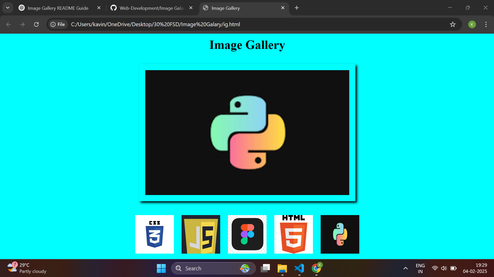

# Simple Image Gallery

## Description
This is a simple image gallery built using HTML and CSS. The gallery displays a collection of images in a visually appealing layout with a responsive design to ensure a seamless viewing experience on different devices.

## Features
- Responsive image grid layout  
- Hover effects for better user experience  
- Easy to customize and extend  
- No JavaScript required  

## Technologies Used
- **HTML5**  
- **CSS3 (Flexbox/Grid)**  

## How to Use
1. Clone the repository:  
   ```bash
   git clone https://github.com/your-username/image-gallery.git


