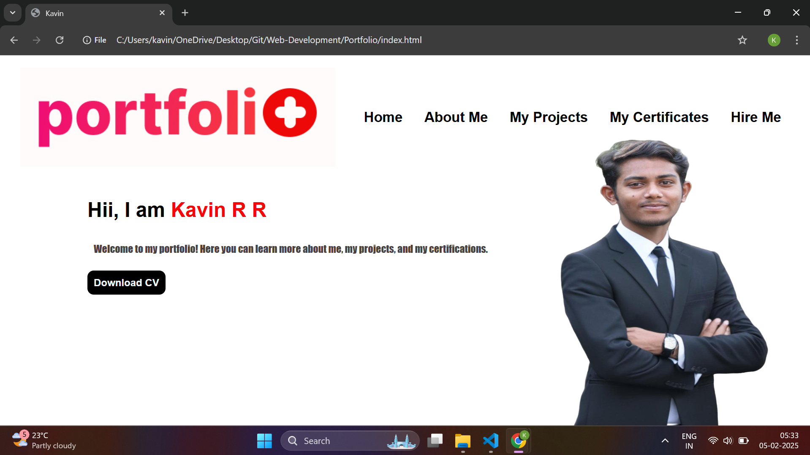

# 🌟 Portfolio Website

# 🌟 Portfolio Website

Welcome to my **[Portfolio Website](https://portfolio-60037378338.development.catalystserverless.in/app/index.html)**, a showcase of my skills, projects, and achievements! 🚀✨

## 🚀 Features
✅ **Clean & Modern UI** 🎨  
✅ **About Me Section** 🧑‍💻  
✅ **Projects Showcase** 💼  
✅ **Certificates Display** 📜  
✅ **Hire Me Contact Form** 📩  
✅ **Responsive Design** 📱💻  

## 🛠️ Tech Stack
- **HTML** 📝
- **CSS** 🎨
- **JavaScript** ⚡
- **React.js** ⚛️ (if applicable)
- **Tailwind CSS** 🎨 (if applicable)

## 📷 Preview


## 🎯 Installation & Setup
Follow these steps to run the project locally:

```bash
# Clone the repository
git clone https://github.com/Kavin-RR/portfolio.git

# Navigate to the project folder
cd portfolio

# Open in browser
Open index.html in your browser
```

## 📌 Usage
1️⃣ **Explore the About Me Section** 🧑‍💻  
2️⃣ **Check Out My Projects** 💼  
3️⃣ **View My Certificates** 📜  
4️⃣ **Contact Me for Opportunities** 📩  

## 📜 License
This project is for personal and educational purposes only. 🎓

## 💡 Contributing
Contributions are welcome! Feel free to fork and submit a PR. 🤝

## 📞 Contact
For any queries, reach out at 📧 [your-email@example.com](kavinaids@gmail.com)

**Thank You for Visiting! 🚀💡**
