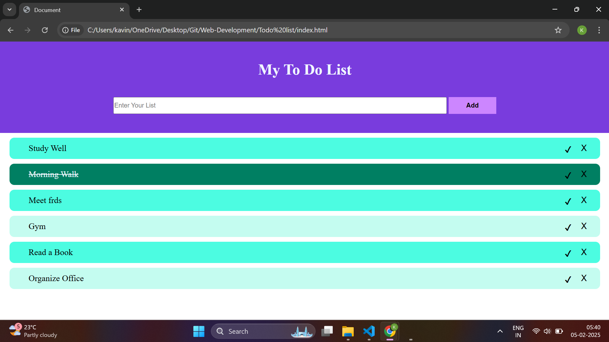

# ✅ To-Do List Application

Welcome to the **To-Do List Application**, a simple and efficient way to manage your daily tasks! 📝✨

## 🚀 Features
✅ **Add, Edit & Delete Tasks** 🗂️  
✅ **Mark Tasks as Completed** ✅  
✅ **Filter & Sort Tasks** 🔍  
✅ **Local Storage Support** 💾  
✅ **Responsive Design** 📱💻  

## 🛠️ Tech Stack
- **HTML** 📝
- **CSS** 🎨
- **JavaScript** ⚡

## 📷 Preview

## 📌 Usage
1️⃣ **Add a New Task** ➕  
2️⃣ **Mark Task as Completed** ✅  
3️⃣ **Edit or Delete Tasks** ✏️❌  
4️⃣ **Filter & Sort Tasks** 🔍  

## 📜 License
This project is for personal and educational purposes only. 🎓

## 💡 Contributing
Contributions are welcome! Feel free to fork and submit a PR. 🤝

**Stay Organized! 📅📝**
