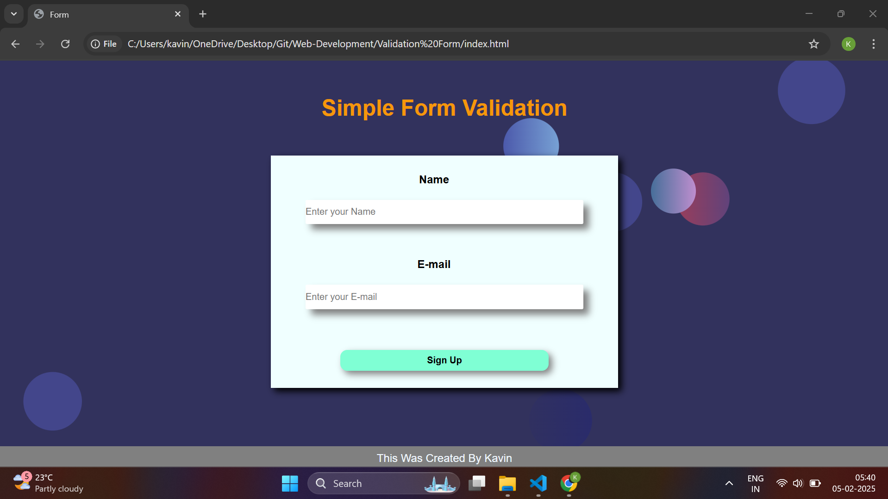

# 📝 Form Validation

Welcome to the **Form Validation Application**, a simple and effective way to validate user inputs! ✅✨

## 🚀 Features
✅ **Real-Time Input Validation** 🔄  
✅ **Email & Password Validation** 🔑  
✅ **Error Messages for Invalid Inputs** ⚠️  
✅ **User-Friendly Interface** 🎨  
✅ **Responsive Design** 📱💻  

## 🛠️ Tech Stack
- **HTML** 📝
- **CSS** 🎨
- **JavaScript** ⚡

## 📷 Preview

## 📌 Usage
1️⃣ **Enter Valid Inputs** 📝  
2️⃣ **See Error Messages for Invalid Fields** ⚠️  
3️⃣ **Submit the Form Successfully** ✅  

## 📜 License
This project is for personal and educational purposes only. 🎓

## 💡 Contributing
Contributions are welcome! Feel free to fork and submit a PR. 🤝

**Happy Coding! 💻🎯**
